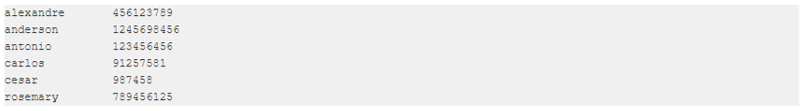
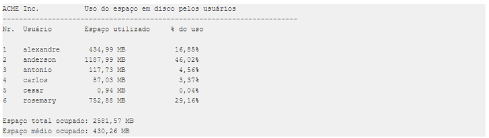

# Python Projeto Controle de Cotas de Disco

## Projeto proposto pelo site <a href="https://wiki.python.org.br/ListaDeExerciciosProjetos">Python Brasil</a>

1. Controle de cotas de disco. A ACME Inc., uma organização com mais de 1500 funcionários, está tendo problemas de espaço em disco no seu servidor de arquivos. Para tentar resolver este problema, o Administrador de Rede precisa saber qual o espaço em disco ocupado pelas contas dos usuários, e identificar os usuários com maior espaço ocupado. Através de um aplicativo baixado da Internet, ele conseguiu gerar o seguinte arquivo, chamado <strong>usuarios.txt</strong>:

Neste arquivo, o primeiro campo corresponde ao login do usuário e o segundo ao espaço em disco ocupado pelo seu diretório home. A partir deste arquivo, você deve criar um programa que gere um relatório, chamado <b>relatório.txt</b>, no seguinte formato:

O arquivo de entrada deve ser lido uma única vez, e os dados armazenados em memória, caso sejam necessários, de forma a agilizar a execução do programa. A conversão da espaço ocupado em disco, de bytes para megabytes deverá ser feita através de uma função separada, que será chamada pelo programa principal. O cálculo do percentual de uso também deverá ser feito através de uma função, que será chamada pelo programa principal.

## Recursos adicionais: opcionalmente, desenvolva as seguintes funcionalidades: ##

* Ordenar os usuários pelo percentual de espaço ocupado
* Mostrar apenas os n primeiros em uso, definido pelo usuário
* Gerar a saída numa página html
* Criar o programa que lê as pastas e gera o arquivo inicial
