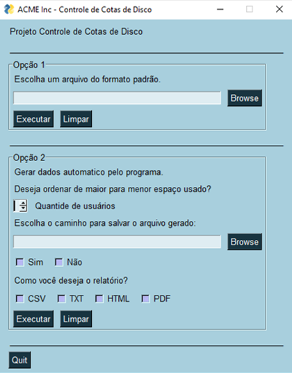

# Desenvolvimento da Interface Grafica 

Objetivo: Mostrar a evolução das versões de interface gráfica desenvolvida com o módulo PySimpleGUI.

Versão 1 - Data: 27/03/2021

&nbsp;

## Alfredo de Morais | Desenvolvedor de Aplicações Python
